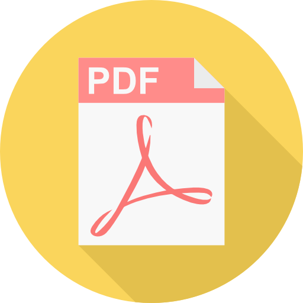

## PDF-Viewer/Creator&nbsp;&nbsp;&nbsp;&nbsp;


### About
> WebPage created to view and create pdf files. I composed structure of the files, according to Dan 
Abromov's
 article, to Presentational and Container Components. In PDF-viewer I used 
library PDF.js to display files, which you can operate without using a computer mouse because of 
keyboard handlers which are showed on the main page of website. I am going to add dropzone, so as
 to 
users 
will be able
 to view theirs 
own files. 
On the other subpage there is the PDF-Creator, where I used React-pdf library. You can add your 
own content like title, paragraphs, and soon also images. At first type text in the tabbed 
window, and then click on the button appropriate to the intended action. 
 The pdf
 will be 
created 
after click on 
'Done' button. 

> I created this website because I didn't find any similar webpages, and it was a good practice 
which developed my programming skills.
[Link 
page.]
(https://pdfviewer-reactjs
.netlify
.com)

### Let's start
```
$ git clone https://github.com/patrikswiatek/PDF-viewer

$ cd PDF-viewer

$ npm i

$ npm start
```

### Documentation
  * #### [React](https://reactjs.org/docs/getting-started.html)
  * #### [Create React App](https://github.com/facebook/create-react-app)


### Languages
* #### HTML
* #### CSS
* #### SCSS
* #### JavaScript
* #### ECMA Script 6

### Built With
* #### Webpack
* #### IDE - Atom
* #### Static server - [Netlify](https://www.netlify.com/)
* #### [PDF.js](http://mozilla.github.io/pdf.js/)
* #### [React-pdf](http://react-pdf.diegomura.com/)    

### License
* #### [MIT License](https://opensource.org/licenses/MIT)

### Helpful articles
* #### [Dan Abramov 'Presentational and Container Components](https://medium.com/@dan_abramov/smart-and-dumb-components-7ca2f9a7c7d0) 
* #### [Sathya Bandara 'Parsing and Rendering PDF with PDF.js](https://medium.com/@technospace/parsing-and-rendering-pdf-with-pdf-js-cad7303e06e5)
